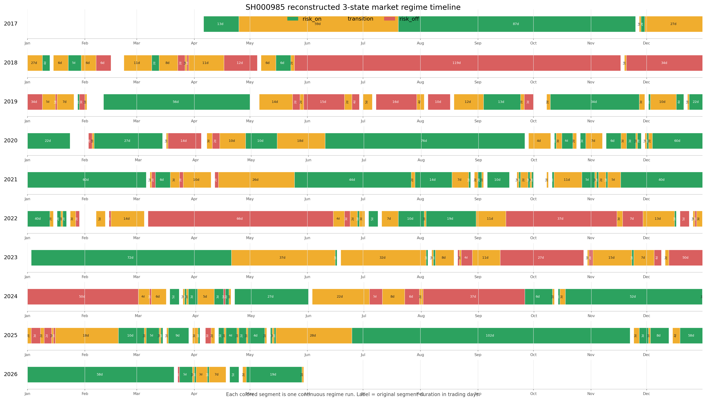

# Experiment F - Transition Sub-Regime Taxonomy Audit 报告

最终决策：`transition_subregime_taxonomy_diagnostic_only`

## 结论

本实验只用于验证 `transition` 这个 residual bucket 是否能被拆成稳定、可解释、可复现的子状态；它不是 official train process，不训练 entry model，也不输出 direct-entry support。

当前证据不支持把 transition 直接推进到 family rediscovery。更准确地说，transition 内部确实存在一些有用的结构信号，例如 deterioration 在 robustness 上 cost 明显更差，R-core 在多数子态仍能保持很高的 post-replay capture；但这些信号没有形成稳定 taxonomy。主要问题是：默认 deterministic taxonomy 被 boundary 大量吞没，自动 120d 聚类退化成一个 boundary-like 大簇，且 robustness 缺少 recovery core 子态，导致 collapse explanation 无法成立。

最终 gate failure：

| failure | 含义 | 影响 |
|:--|:--|:--|
| `missing_core_subregime:robustness` | robustness 中 default recovery 子态没有可读 episode denominator | 无法证明子态在 out-of-time split 稳定 |
| `boundary_over_capture_gt_40pct` | boundary/mixed 捕获了过多 transition events | 子状态解释力被 margin bucket 稀释 |
| `kmeans_status:elbow_overlap_instability_diagnostic` | 120d rolling window 的 elbow/kmeans 在 block stability 上不稳 | 自动 taxonomy 不能作为 supported evidence |
| `effective_independent_window_n_lt_50` | train 名义窗口 230 个，但有效独立窗口约 34.9 | rolling 120d 高重叠导致聚类统计 power 偏低 |
| `collapse_not_explained` | 子态拆分没有解释 robustness collapse | 只能作为 diagnostic，不可升级 |

## 数据与契约

本实验使用 D 的 post-replay event-episode membership 作为 episode readout 主源，使用 SH000985 作为 date-level market component 主源。所有 taxonomy assignment 都是 `market_date` 粒度，不使用 instrument-level 特征做聚类；未来 label 只用于 readout，不进入 taxonomy feature。

| 项 | 数值 / 状态 |
|:--|:--|
| transition event assignment rows | 25,214 |
| transition 120d market windows | 516 |
| train / validation / robustness windows | 230 / 192 / 94 |
| train / validation / robustness event count | 11,497 / 9,104 / 4,613 |
| train / validation / robustness episode count in windows | 3,383 / 1,534 / 1,337 |
| component source | `SH000985` |
| component date range | 2017-01-03 至 2026-05-29 |
| component source rows | 2,281 |
| event-level component joins | 90,576 |
| future join rows | 0 |
| 60d legacy vs 120d taxonomy horizon | audited mismatch |
| component reconstruction consistency | 81.17% |
| legacy drawdown60 consistency | 74.49% |

component consistency 不是 95% 以上，原因不是直接的数据断裂，而是 upstream legacy bucket 使用 60d drawdown，而本实验 taxonomy 按需求使用 120d drawdown。这个 mismatch 被记录为 `horizon_mismatch_audited`，因此它不应被解释成 leakage 或 join 失败；但它也说明本实验的 taxonomy 结果不能直接回填 upstream regime label。

## 三状态 Regime 时间轴

下图按 SH000985 重建的三状态 regime 绘制：绿色为 `risk_on`，黄色为 `transition`，红色为 `risk_off`。每个色块是一段连续相同 regime，色块中的数字为该段原始持续交易日数。为避免 2017-2026 全周期挤在一条轴上，图按年份分行；跨年段会在视觉上被年份行切开，但标签仍保留该连续段的总交易日数。

精确 segment 表：`outputs/publishable/tables/transition_subregime_taxonomy_audit/transition_three_state_regime_segments.csv`。可缩放版本：`outputs/publishable/reports/transition_subregime_taxonomy_audit/transition_three_state_regime_timeline.svg`。

## 特征与处理方式

自动 taxonomy 使用 44 个 date-level market-state features。所有 feature 的 `as_of_policy` 为 `window_end_date = event_t0_date; no future rows`，窗口长度为 120 个交易日，feature grain 为 `date_level_market_state`。

特征分组：

| 分组 | 特征内容 | 数量 |
|:--|:--|--:|
| 指数趋势 / 波动 / 回撤 | 20d/60d/120d return、volatility、60d/120d drawdown、distance from 120d high | 9 |
| 市场宽度与板块相对强度 | universe up share、new-high share、up-share z/change、board relative/cumsum | 6 |
| 斜率与方向熵 | trend slope 20d/60d、vol change、direction entropy 20d/60d | 5 |
| 120d rolling summary | breadth / new-high / board-relative / board-cumsum 的 mean/min/max/slope | 16 |
| 状态占比与边界距离 | risk_on/off/transition fraction、days since last state、trend/drawdown boundary distance | 8 |

处理方式是严格 train-only：

| 步骤 | 规则 |
|:--|:--|
| missing imputation | 用 train transition 120d windows 的 median 填补 |
| winsorization | 用 train 的 1% / 99% 分位裁剪 |
| normalization | 用 train mean/std 做 z-score |
| validation / robustness | 只应用 train 得到的参数，不重新估计 |
| train row count | 230 |

这组处理足够用于验证 taxonomy 是否有信号，但不能视为官方训练流程。尤其是 120d rolling windows 高度重叠，train 的名义样本 230 个，按 lag1 autocorrelation 0.736 估计的有效独立窗口只有 34.92；这使 silhouette/elbow 的统计稳定性明显不足。

## Default Taxonomy

默认 taxonomy 的定义逻辑是：`transition` 是 risk_on / risk_off 之外的 residual bucket，recovery 与 deterioration 是二分核心态；boundary/mixed 是在趋势/回撤边界附近或高波动区间做的 margin reclassification，不是第三个原生状态。

| split | subregime | event_n | event_share | target_episode_n | target_episode_share | E1-missed episode_n | E1-missed share |
|:--|:--|--:|--:|--:|--:|--:|--:|
| train | boundary_or_mixed | 9,102 | 79.2% | 984 | 96.1% | 677 | 76.3% |
| train | deterioration | 1,725 | 15.0% | 235 | 22.9% | 148 | 78.3% |
| train | recovery | 670 | 5.8% | 204 | 19.9% | 157 | 89.7% |
| validation | boundary_or_mixed | 5,797 | 63.7% | 355 | 95.7% | 210 | 70.5% |
| validation | deterioration | 2,968 | 32.6% | 129 | 34.8% | 79 | 76.7% |
| validation | recovery | 339 | 3.7% | 77 | 20.8% | 33 | 80.5% |
| robustness | boundary_or_mixed | 3,699 | 80.2% | 537 | 99.0% | 322 | 68.8% |
| robustness | deterioration | 914 | 19.8% | 112 | 20.6% | 52 | 82.5% |
| robustness | recovery | 0 | 0.0% | 0 | 0.0% | 0 | n/a |

关键观察：

1. boundary/mixed 在三个 split 都过大，尤其 train 79.2%、robustness 80.2%。这说明当前 margin rule 把 transition 的主质量都吸进了边界桶，core state 解释空间不足。
2. robustness 完全没有 recovery core 子态。即使 deterioration 有 112 个 target episodes，recovery 缺失仍会触发 `missing_core_subregime:robustness`，因为 supported taxonomy 至少要证明两个 core 子态都能 out-of-time 复现。
3. episode share 会超过 100% 的直觉约束，因为同一个 target episode 可被不同 date/subregime 的事件覆盖；因此这里的 episode readout 是“子态覆盖过的 unique target episode”，不是互斥分桶的 episode composition。

## 自动 120d Taxonomy

自动 taxonomy 做了两条路径：无监督 `auto_120d_elbow_kmeans` 和用默认标签做 seed-propagation 的 `auto_120d_knn_default_taxonomy`。两者都只用于 diagnostic。

KMeans 结果：

| k | inertia | silhouette | min_cluster_share | max_cluster_share | selected | status |
|--:|--:|--:|--:|--:|:--|:--|
| 2 | 8,469.02 | 0.186 | 35.2% | 64.8% | no | diagnostic |
| 3 | 7,276.49 | 0.201 | 6.1% | 64.8% | yes | diagnostic |
| 4 | 6,572.75 | 0.157 | 6.1% | 47.0% | no | diagnostic |
| 5 | 6,062.29 | 0.170 | 6.1% | 41.3% | no | diagnostic |
| 6 | 5,594.19 | 0.177 | 6.1% | 25.7% | no | diagnostic |
| 7 | 5,208.84 | 0.198 | 6.1% | 23.9% | no | diagnostic |
| 8 | 4,828.12 | 0.217 | 3.9% | 24.3% | no | min cluster <5% |

KMeans 选出 k=3，但三个 cluster 在解释层面全部被标成 `auto_boundary_or_mixed_like`：

| split | cluster/date 分布 | 自动标签 |
|:--|:--|:--|
| train | 149 / 67 / 14 | 全部 boundary-like |
| validation | 174 / 1 / 17 | 全部 boundary-like |
| robustness | 70 / 24 | 全部 boundary-like |

Block stability 也没有通过：rolling selected k=3，block-sampled selected k=2，ARI=0.148，NMI=0.193，状态为 `block_stability_failed`。这意味着自动聚类捕捉到的更像是 rolling window 重叠和边界状态强度，而不是稳定可命名的 transition sub-regime。

KNN 结果：

| split | high confidence windows | low confidence windows | 说明 |
|:--|--:|--:|:--|
| train | 230 | 0 | 训练标签回放，不能视为独立验证 |
| validation | 192 | 0 | 可作 diagnostic |
| robustness | 91 | 3 | 可作 diagnostic |

KNN 在 validation/robustness 可以把 boundary 一部分分给 recovery/deterioration，但它是默认 taxonomy 的 seed propagation，不能单独支撑 supported conclusion。它更适合说明“如果沿用默认标签，邻域传播能给出局部相似性”，不适合说明“市场自己形成了稳定三态”。

## Recall 与 E1-Missed Capture

下面只看 default deterministic taxonomy、headline window `low_to_first_50pct`、policy `post_replay_executable_horizon_complete`。

| split | subregime | source | target_episode_n | E1 recall | source recall | E1-missed n | captured E1-missed | capture over E1-missed |
|:--|:--|:--|--:|--:|--:|--:|--:|--:|
| train | boundary | R-core | 887 | 23.7% | 97.3% | 677 | 673 | 99.4% |
| train | recovery | R-core | 175 | 10.3% | 97.7% | 157 | 157 | 100.0% |
| train | deterioration | R-core | 189 | 21.7% | 94.2% | 148 | 146 | 98.6% |
| validation | boundary | R-core | 298 | 29.5% | 98.0% | 210 | 208 | 99.0% |
| validation | recovery | R-core | 41 | 19.5% | 87.8% | 33 | 32 | 97.0% |
| validation | deterioration | R-core | 103 | 23.3% | 95.1% | 79 | 78 | 98.7% |
| robustness | boundary | R-core | 468 | 31.2% | 95.7% | 322 | 321 | 99.7% |
| robustness | deterioration | R-core | 63 | 17.5% | 96.8% | 52 | 50 | 96.2% |
| train | boundary | R6 | 887 | 23.7% | 79.6% | 677 | 540 | 79.8% |
| train | recovery | R6 | 175 | 10.3% | 81.1% | 157 | 128 | 81.5% |
| train | deterioration | R6 | 189 | 21.7% | 44.4% | 148 | 71 | 48.0% |
| robustness | boundary | R6 | 468 | 31.2% | 70.5% | 322 | 226 | 70.2% |
| robustness | deterioration | R6 | 63 | 17.5% | 65.1% | 52 | 31 | 59.6% |

这里有两个强信号：

1. R-core 作为 post-replay recall source 在 transition 子态内依然很强。train/validation/robustness 的 boundary 与 deterioration 基本都在 94% 以上，E1-missed capture 也大多在 96% 以上。
2. R6 的 recall 明显更依赖子态。尤其 train deterioration 只有 44.4%，robustness deterioration 65.1%，远低于 R-core。这说明 R6 不是 transition 子态上的稳定替代源。

但这些强 recall 不等于 taxonomy supported。原因是 recall source 能覆盖 transition，不代表 taxonomy 能解释 transition collapse；当前核心问题仍是子状态不稳定、boundary 过大、robustness recovery 缺失。

## Cost / Quality Readout

cost readout 显示 deterioration 在 robustness 上更“脏”，这是本实验最有价值的诊断信号之一。

| split | subregime | source | event_n | fast-fail 10d | false-repair 20d | big-winner 120d |
|:--|:--|:--|--:|--:|--:|--:|
| train | boundary | R-core | 1,878 | 16.4% | 19.6% | 43.6% |
| train | recovery | R-core | 225 | 9.3% | 5.3% | 50.7% |
| train | deterioration | R-core | 261 | 13.4% | 11.1% | 33.7% |
| robustness | boundary | R-core | 783 | 7.4% | 13.3% | 44.2% |
| robustness | deterioration | R-core | 102 | 24.5% | 30.4% | 47.1% |
| train | boundary | R6 | 790 | 17.4% | 21.5% | 44.7% |
| train | recovery | R6 | 142 | 11.3% | 6.3% | 48.6% |
| train | deterioration | R6 | 85 | 9.4% | 7.1% | 42.4% |
| robustness | boundary | R6 | 383 | 8.4% | 13.8% | 46.7% |
| robustness | deterioration | R6 | 41 | 26.8% | 34.1% | 53.7% |

解读：

1. train 上 recovery 是相对干净的子态：R-core fast-fail 9.3%、false-repair 5.3%，且 big-winner 120d 50.7%。这符合“回撤后恢复”可能更有正向收益空间的直觉。
2. robustness 上 deterioration 明显变差：R-core fast-fail 24.5%、false-repair 30.4%；R6 fast-fail 26.8%、false-repair 34.1%。这说明 deterioration 是 transition 内部真正需要成本控制的区域。
3. 但 robustness 没有 recovery core 子态，所以无法形成“recovery 好 / deterioration 差”的稳定 out-of-time 二分证据。它只能说明 deterioration risk 存在，不能说明当前 taxonomy 已经完整解释了 transition。

## Density / Overlap

density 使用 `A_density_contract_replay_anchor_pos`，即按 replay anchor 计算，而不是用 event_t0 或 trade_open 混算。

| split | subregime | source | selected_event_n | formal event-day density | rolling 10d density | rolling 20d density | 10d duplicate | 20d duplicate |
|:--|:--|:--|--:|--:|--:|--:|--:|--:|
| train | boundary | R-core | 1,878 | 10.61 | 1.51 | 1.67 | 39.8% | 47.1% |
| train | recovery | R-core | 225 | 37.50 | 1.26 | 1.26 | 24.0% | 24.0% |
| train | deterioration | R-core | 261 | 6.52 | 1.28 | 1.38 | 24.5% | 30.3% |
| robustness | boundary | R-core | 783 | 11.19 | 1.33 | 1.39 | 27.8% | 31.5% |
| robustness | deterioration | R-core | 102 | 4.64 | 1.46 | 1.53 | 35.3% | 40.2% |
| train | boundary | R6 | 790 | 11.79 | 1.00 | 1.02 | 0.0% | 2.0% |
| train | recovery | R6 | 142 | 35.50 | 1.00 | 1.00 | 0.0% | 0.0% |
| train | deterioration | R6 | 85 | 7.73 | 1.00 | 1.00 | 0.0% | 0.0% |
| robustness | boundary | R6 | 383 | 19.15 | 1.00 | 1.00 | 0.0% | 0.0% |
| robustness | deterioration | R6 | 41 | 6.83 | 1.00 | 1.00 | 0.0% | 0.0% |

R-core 的 recall 高，但也伴随较高 duplicate/overlap，尤其 train boundary 20d duplicate 47.1%、robustness deterioration 20d duplicate 40.2%。这说明 R-core 是有效 recall source，但直接把它当作 entry pool 会带来成本和拥挤度问题；这也支持后续应走 cost rejector，而不是继续追 entry-ranker compression。

R6 的 density 更干净，但 recall 不稳定，尤其 deterioration 子态弱。因此 R6 更像是低密度补充源，不是 transition 的主 recall source。

## Findings / Insight

1. transition 不是一个单一可交易状态，而是 residual bucket。当前数据最清楚的信号不是“三个稳定子状态”，而是“boundary 占主导 + deterioration 风险抬升 + recovery 在 robustness 消失”。

2. 默认 taxonomy 的 recovery/deterioration 二分有经济直觉，但 boundary rule 太强。boundary 捕获 63.7%-80.2% 的 event，并覆盖 95% 以上 target episodes，使得 core 子态的解释力被稀释。下一步若继续做 taxonomy，应先重新校准 margin rule，而不是直接增加更多 family。

3. 自动 120d 聚类没有发现新的稳定 taxonomy。k=3 只是 elbow 数学上的选择，解释层面全部塌缩为 boundary-like；block sample 又选择 k=2 且 ARI/NMI 很低。这个结果更像是“transition 的市场路径连续变化”，不是自然离散分类。

4. R-core 在子态内仍然是强 recall source。它能在 boundary/deterioration 上保持高 episode recall 和 E1-missed capture，这验证了 post-replay recall source 的价值。但它的 overlap/density 和 deterioration cost 风险也很明显，因此下一步重点应是 cost-side rejector，而不是把 taxonomy 当 entry support。

5. deterioration 是最值得被风险控制标记的 transition 区域。robustness deterioration 的 false-repair 约 30%-34%，远高于 boundary 的 13%-14%。即使 taxonomy 不能 supported，这个 readout 对后续 rejector feature 设计有价值。

6. recovery 的信号目前不能用于 supported claim。train/validation recovery 看起来较干净，但 robustness 没有 recovery core denominator。任何“recovery 子态更优”的说法都必须加 caveat，只能作为 hypothesis。

## 建议

1. 不推进 transition-specific family rediscovery。当前 taxonomy 没有解释 collapse，继续 rediscovery 容易把 residual bucket 的混合机制误当成新 family。

2. 若继续 taxonomy 方向，优先调整 deterministic boundary rule：降低 boundary over-capture，明确 recovery/deterioration core 的最小覆盖要求，再重新做 robustness readout。

3. 自动分类方向不要依赖高度重叠的 rolling 120d window 单独作 gate。应增加 non-overlap 或 block-sampled 稳定性作为硬约束，并报告 effective independent n。

4. 更现实的下一步是沿 Experiment E 的方向做 post-filter / cost rejector：以 R-core/R6 replay membership 为 recall source，以 deterioration/boundary cost readout 作为风险侧监督信号，目标是保留 bridge/E1-missed capture，同时筛掉 fast-fail/false-repair。

## 不可声称内容

- 不得声称 direct-entry support。
- 不得声称 official train process。
- 不得声称 transition taxonomy 已 supported。
- 不得把 instrument-level cluster 解释为 market sub-regime。
- kNN seed-label propagation 不能单独支撑 supported。
- validation 只作 diagnostic，不得调 taxonomy rule。
