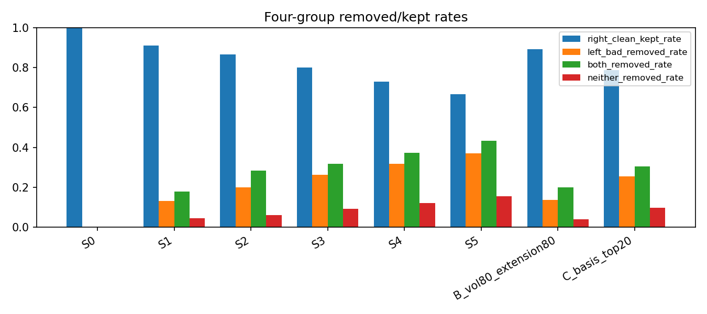
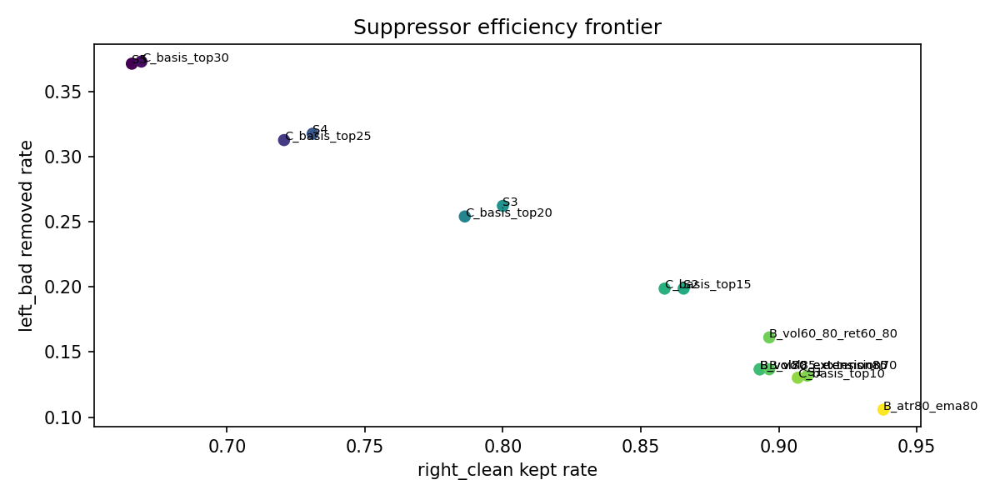
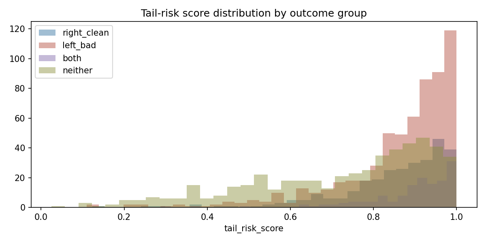
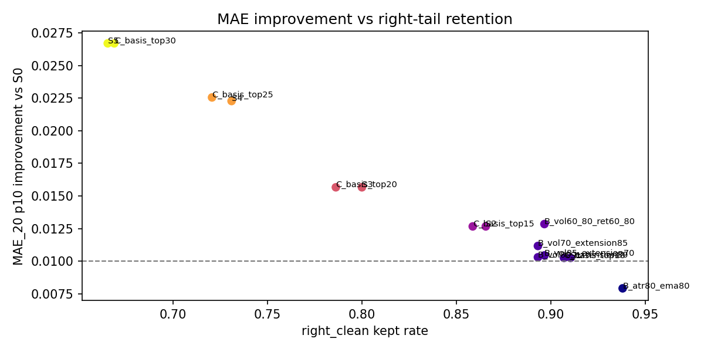

# 19B2 B2 高波动强势延伸左尾 suppressor 消融报告

19B2 是 diagnostic-only suppressor ablation。
T0 suppressor ablation 不等于 alpha support。
validation outcome read = false。
19C replay authorized = false。
EP20 policy preflight authorized = false。
entry/exit/holding/portfolio/model/production/live trading authorization = false。
任何 delayed confirmation、entry timing 或 left-tail rejector model 都必须作为新的 pre-registered requirement。

## 执行结论

本轮 19B2 不是一个交易规则通过结论，而是一个“风险桶有解释力、但交互 suppressor 没有超过单因子对照”的诊断结论。

- decision_state = `19B2_suppressor_improves_burden_but_not_interaction_supported_diagnostic`。
- blocking_reason = `interaction_superiority_gate_failed`。
- 运行时间戳 = `2026-07-09T14:58:48Z`。
- candidate_n = 1,552，instrument_n = 524。
- 19B1 四分组沿用结果：right_clean = 290，left_bad = 614，both = 145，neither = 503。
- variant_n_total = 30，variant_n_primary = 15。
- best primary variant = `B_vol60_80_ret60_80`，family = `logical_interaction`。
- best variant 删除 186 / 1,552 个候选，candidate_removed_rate = 0.119845。
- best variant 保留 right_clean 0.896552，删除 left_bad 0.161238，删除 both 0.213793。
- best variant 的 left_bad_removed_per_right_clean_removed = 3.300000。
- best variant 的 p_candidate_50_after = 0.273792，低于 S0 的 0.280284。
- best variant 的 MAE_20_p10_improvement_vs_S0 = 0.012845，MAE_worsening_after = 0.079814。
- 最强预算匹配单因子对照 = `A_ATR20_top10`，interaction efficiency lift = -0.266667，bootstrap CI low = -0.687814。

核心判断：B2 高波动/强势延伸区域确实包含更多左尾负担，删除后 MAE 左尾有所改善；但这种改善没有证明来自“高波动 x 强势延伸”的交互结构。`A_ATR20_top10` 在接近同等删除预算下，以更高效率保留了更多 right_clean，并且给出更高的 p_candidate_50_after。因此 19B2 只能作为 high-risk bucket 的假设来源，不能授权 19C replay 或 EP20 policy preflight。

## 数据与合同闭包

本轮读数使用 `candidate_primary_denominator`，split = `robustness`。关键合同门全部通过，失败只在 interaction superiority：

| gate | 状态 | 说明 |
| --- | --- | --- |
| config_contract_gate | pass | 运行配置与 frozen contract 匹配 |
| input_artifact_gate | pass | 输入 artifact hash 与 manifest 对齐 |
| upstream_19a/19b0/19b/19b1_contract_gate | pass | 上游读数可追溯 |
| sample_support_gate | pass | 样本支持通过 |
| primary_row_join_gate | pass | 主行 join 闭包通过 |
| feature_pit_gate | pass | suppressor 特征按 t0 as-of 生成 |
| rank_source_gate | pass | rank 来源通过 |
| score_contract_gate | pass | score 构造合同通过 |
| variant_grid_gate | pass | variant grid 合同通过 |
| ablation_metric_gate | pass | 消融指标闭包通过 |
| interaction_superiority_gate | fail | 主因：交互/组合 suppressor 没有优于预算匹配单因子 |
| policy_authorization_gate | pass | pass 的含义是确认禁止授权被正确执行 |
| output_contract_gate | pass | 输出文件、边界语句和 hash 合同通过 |

feature source audit 显示 4 个 primary score 特征均为 t0 可用，且 left_bad/right_clean 内无缺失：

| feature | source alias | asof_rule | missing_rate | used_in_primary_score | gate |
| --- | --- | --- | ---: | --- | --- |
| `match_vol60` | rolling_60d_volatility_bucket_asof_decision_date | event_t0_date close | 0.000 | true | pass |
| `atr_20_pct_asof_decision_date` | qfq true_range rolling20 / close | event_t0_date close | 0.000 | true | pass |
| `return_60d_asof_decision_date` | qfq close 60d return | event_t0_date close | 0.000 | true | pass |
| `close_to_ema60_asof_decision_date` | qfq close / ema60 - 1 | event_t0_date close | 0.000 | true | pass |

rank source audit 覆盖 426 个 decision_date，日期范围为 2024-01-02 到 2025-11-25。每个交易日的 rank_cross_section_n 在 495 到 500 之间，中位数 499；426 个日期全部 `rank_source_gate = pass`。这意味着本轮分位数和 score 排序不是事后 outcome 排序，而是 t0 前可用特征的横截面排序。

## 四分组读法

19B2 必须保留 19B1 的四组语义：

- `right_clean`：右尾命中且没有左尾污染，是希望尽量保留的候选。
- `left_bad`：左尾污染，是希望 suppressor 优先删除的候选。
- `both`：同时满足右尾和左尾，不能粗暴并入 left_bad；过度删除 both 可能指向 exit/holding 风险，而不是 entry suppressor。
- `neither`：既不贡献右尾，也没有显著左尾，是负担和机会都较弱的候选。

`both 被单独输出`，且本轮不根据 `both` 的 future outcome membership 生成任何 T0 entry action。

四组数量结构显示，left_bad 是最大组：614 / 1,552，占 39.6%；right_clean 为 290 / 1,552，占 18.7%；both 为 145 / 1,552，占 9.3%。因此本轮问题不是“没有左尾负担”，而是“能否在不误杀 right_clean 的情况下，用 pre-outcome 特征选择性删除 left_bad”。

## Score 分布

`tail_risk_score` 按 outcome group 的分位数如下：

| outcome_group | n | mean | p25 | median | p75 | p90 | p95 |
| --- | ---: | ---: | ---: | ---: | ---: | ---: | ---: |
| both | 145 | 0.891499 | 0.855624 | 0.921369 | 0.973996 | 0.989958 | 0.995594 |
| left_bad | 614 | 0.858655 | 0.817782 | 0.905682 | 0.962082 | 0.986035 | 0.995985 |
| right_clean | 290 | 0.849809 | 0.795972 | 0.886001 | 0.950450 | 0.978085 | 0.987103 |
| neither | 503 | 0.723055 | 0.576347 | 0.783295 | 0.899737 | 0.955931 | 0.981772 |

这个分布给出两个同时成立的事实：

1. left_bad 和 both 的分数确实整体更靠右，尤其 both 的 median = 0.921369，left_bad 的 median = 0.905682，都高于 neither 的 0.783295。
2. right_clean 的分数也很高，median = 0.886001，p75 = 0.950450；这说明高分区并不是纯左尾风险区，而是“高波动/强势延伸带来的两尾放大区”。

这解释了为什么 suppressor 能改善左尾负担，却不能直接升级为 entry policy：它删除的是一个风险和机会同时升高的区域。

## 主消融结果

S0 是 keep-all baseline。S1-S5 是按 `tail_risk_score` 删除 top 10% 到 top 30%。A 是预算匹配单因子对照，B 是逻辑交互，C 是 basis risk score，D 是描述性的 volatility contraction 审计。

| variant | family | removed_rate | right_clean_kept | left_bad_removed | both_removed | efficiency | p_candidate_50_after | MAE_p10_improve | MAE_worsening | gate |
| --- | --- | ---: | ---: | ---: | ---: | ---: | ---: | ---: | ---: | --- |
| S0 | baseline | 0.000000 | 1.000000 | 0.000000 | 0.000000 | 0.000000 | 0.280284 | 0.000000 | 0.092659 | fail |
| S1 | tail_risk_score_top_pct | 0.100515 | 0.910345 | 0.131922 | 0.179310 | 3.115385 | 0.274355 | 0.010255 | 0.082405 | pass |
| S2 | tail_risk_score_top_pct | 0.150129 | 0.865517 | 0.198697 | 0.282759 | 3.128205 | 0.269143 | 0.012665 | 0.079995 | pass |
| S3 | tail_risk_score_top_pct | 0.200387 | 0.800000 | 0.262215 | 0.317241 | 2.775862 | 0.266720 | 0.015664 | 0.076996 | pass |
| S4 | tail_risk_score_top_pct | 0.250000 | 0.731034 | 0.317590 | 0.372414 | 2.500000 | 0.260309 | 0.022277 | 0.070382 | pass |
| S5 | tail_risk_score_top_pct | 0.300258 | 0.665517 | 0.371336 | 0.434483 | 2.350515 | 0.253223 | 0.026700 | 0.065959 | fail |
| B_vol60_80_ret60_80 | logical_interaction | 0.119845 | 0.896552 | 0.161238 | 0.213793 | 3.300000 | 0.273792 | 0.012845 | 0.079814 | pass |
| B_atr80_ema80 | logical_interaction | 0.075387 | 0.937931 | 0.105863 | 0.110345 | 3.611111 | 0.279443 | 0.007917 | 0.084743 | fail |
| C_basis_top10 | basis_risk_score_top_pct | 0.100515 | 0.906897 | 0.130293 | 0.165517 | 2.962963 | 0.275072 | 0.010255 | 0.082405 | pass |
| C_basis_top15 | basis_risk_score_top_pct | 0.150129 | 0.858621 | 0.198697 | 0.262069 | 2.975610 | 0.269901 | 0.012665 | 0.079995 | pass |
| C_basis_top20 | basis_risk_score_top_pct | 0.200387 | 0.786207 | 0.254072 | 0.303448 | 2.516129 | 0.265109 | 0.015664 | 0.076996 | pass |
| C_basis_top25 | basis_risk_score_top_pct | 0.250000 | 0.720690 | 0.312704 | 0.372414 | 2.370370 | 0.257732 | 0.022553 | 0.070107 | pass |

S 系列呈现清晰 trade-off：删除比例越高，left_bad_removed 和 MAE_20_p10 改善越高，但 right_clean_kept 和 p_candidate_50_after 越低。S5 删除 30.0% 候选后，MAE 改善最大，但 right_clean kept 只有 0.665517，低于主门槛，因此失败。S1-S4 通过主消融门槛，但它们仍没有通过预算匹配的 superiority gate。

best variant `B_vol60_80_ret60_80` 删除的是候选横截面中 `q_vol60` 和 `q_ret60` 同时位于高分位的区域。它比 S1/S2 更像一个明确机制假设，效率 3.300000 也是 primary pass rows 中最高；但它的优势只是在 primary rows 内部成立，不在 single-feature comparator 上成立。

## 单因子与预算匹配对照

预算匹配对照是本轮最关键的失败来源。单因子 A 族不是候选 policy，它们用于回答：同样删掉约 10%、20%、30% 的候选时，交互 score 是否真的比单一波动/ATR/近端涨幅更有效。

| comparator | removed_rate | right_clean_kept | left_bad_removed | both_removed | efficiency | p_candidate_50_after | MAE_p10_improve |
| --- | ---: | ---: | ---: | ---: | ---: | ---: | ---: |
| A_VOL60_top10 | 0.100515 | 0.900000 | 0.140065 | 0.151724 | 2.965517 | 0.275072 | 0.010816 |
| A_ATR20_top10 | 0.102448 | 0.931034 | 0.146580 | 0.144828 | 4.500000 | 0.282843 | 0.011443 |
| A_RET60_top10 | 0.108247 | 0.896552 | 0.138436 | 0.172414 | 2.833333 | 0.274566 | 0.010785 |
| A_VOL60_top20 | 0.201031 | 0.800000 | 0.267101 | 0.317241 | 2.827586 | 0.266935 | 0.017155 |
| A_ATR20_top20 | 0.203608 | 0.803448 | 0.268730 | 0.255172 | 2.894737 | 0.275890 | 0.014804 |
| A_RET60_top20 | 0.201031 | 0.827586 | 0.244300 | 0.303448 | 3.000000 | 0.275000 | 0.011700 |
| A_VOL60_top30 | 0.302835 | 0.693103 | 0.382736 | 0.448276 | 2.640449 | 0.259704 | 0.028881 |
| A_ATR20_top30 | 0.304124 | 0.665517 | 0.368078 | 0.420690 | 2.329897 | 0.256481 | 0.019738 |
| A_RET60_top30 | 0.300258 | 0.710345 | 0.359935 | 0.358621 | 2.630952 | 0.275322 | 0.011657 |

最强反例是 `A_ATR20_top10`：它只删除 10.24% 候选，却保留 right_clean = 0.931034，删除 left_bad = 0.146580，efficiency = 4.500000，并且 p_candidate_50_after = 0.282843，高于 S0 的 0.280284。相比之下，best B variant 删除更多候选 11.98%，right_clean kept 只有 0.896552，p_candidate_50_after = 0.273792。

因此，B2 的“高波动强势延伸”叙事不能被读成“交互结构被验证”。更稳健的读法是：左尾污染与波动/ATR/近端涨幅相关，但当前冻结的交互 score 没有提供超过 ATR 单因子的可交易选择性。

## Interaction superiority 失败明细

| primary_variant | comparator | primary_eff | comparator_eff | lift_pct | CI_low | CI_high | primary_p50 | comparator_p50 | gate |
| --- | --- | ---: | ---: | ---: | ---: | ---: | ---: | ---: | --- |
| S1 | A_ATR20_top10 | 3.115385 | 4.500000 | -0.307692 | -0.704227 | 0.523750 | 0.274355 | 0.282843 | fail |
| S2 | A_ATR20_top10 | 3.128205 | 4.500000 | -0.304843 | -0.688450 | 0.623193 | 0.269143 | 0.282843 | fail |
| S3 | A_RET60_top20 | 2.775862 | 3.000000 | -0.074713 | -0.523195 | 0.868824 | 0.266720 | 0.275000 | fail |
| S4 | A_RET60_top20 | 2.500000 | 3.000000 | -0.166667 | -0.575795 | 0.615744 | 0.260309 | 0.275000 | fail |
| B_vol80_extension80 | A_ATR20_top10 | 2.709677 | 4.500000 | -0.397849 | -0.723100 | 0.294752 | 0.270173 | 0.282843 | fail |
| B_vol70_extension85 | A_ATR20_top10 | 2.709677 | 4.500000 | -0.397849 | -0.725422 | 0.285031 | 0.271284 | 0.282843 | fail |
| B_vol85_extension70 | A_ATR20_top10 | 2.800000 | 4.500000 | -0.377778 | -0.729165 | 0.413973 | 0.272793 | 0.282843 | fail |
| B_atr80_ema80 | A_ATR20_top10 | 3.611111 | 4.500000 | -0.197531 | -0.648541 | 0.842130 | 0.279443 | 0.282843 | fail |
| B_vol60_80_ret60_80 | A_ATR20_top10 | 3.300000 | 4.500000 | -0.266667 | -0.687814 | 0.845285 | 0.273792 | 0.282843 | fail |
| C_basis_top10 | A_ATR20_top10 | 2.962963 | 4.500000 | -0.341564 | -0.717507 | 0.500085 | 0.275072 | 0.282843 | fail |
| C_basis_top15 | A_ATR20_top10 | 2.975610 | 4.500000 | -0.338753 | -0.699593 | 0.461916 | 0.269901 | 0.282843 | fail |
| C_basis_top20 | A_RET60_top20 | 2.516129 | 3.000000 | -0.161290 | -0.576879 | 0.684573 | 0.265109 | 0.275000 | fail |
| C_basis_top25 | A_RET60_top20 | 2.370370 | 3.000000 | -0.209877 | -0.578542 | 0.458660 | 0.257732 | 0.275000 | fail |
| C_basis_top30 | A_VOL60_top30 | 2.385417 | 2.640449 | -0.096587 | -0.487890 | 0.528992 | 0.254144 | 0.259704 | fail |

这里的失败不是“完全没效果”，而是“无法证明交互/组合效果优于简单单因子”。多数 lift_pct 为负，CI_low 也明显小于 0；即使 CI_high 有时为正，也不足以通过预注册 superiority gate。

## D 类描述性规则

D 类规则不是 primary success 候选，而是用于描述 volatility contraction 维度是否可能另有方向：

| variant | removed_rate | right_clean_kept | left_bad_removed | both_removed | efficiency | p_candidate_50_after | MAE_p10_improve | MAE_worsening | gate |
| --- | ---: | ---: | ---: | ---: | ---: | ---: | ---: | ---: | --- |
| D_atr20_over_vol60_top20 | 0.200387 | 0.817241 | 0.153094 | 0.158621 | 1.773585 | 0.289283 | -0.008730 | 0.101390 | fail |
| D_rank_spread_top20 | 0.200387 | 0.848276 | 0.149837 | 0.082759 | 2.090909 | 0.305399 | -0.009578 | 0.102237 | fail |

这两行很有信息量：它们提高了 p_candidate_50_after，但 MAE_20_p10 反而变差，MAE_worsening_after 上升到 0.101 附近。也就是说，某些 volatility contraction 描述性规则更像右尾保留/筛选方向，而不是左尾 suppressor 方向；不能把它们混入 B2 左尾抑制结论。

## Support 与 concentration

support comparator 使用 `eligible_universe_primary`，support_comparator_n = 212,415。所有列为 descriptive gate，不是主授权门。

| variant | candidate_after | instrument_after | winner_instrument_after | max_SMD | max_SMD_feature | SMD_market_cap | SMD_amount20 | SMD_vol60 | SMD_return20 | top10_winner_share | top20_winner_share |
| --- | ---: | ---: | ---: | ---: | --- | ---: | ---: | ---: | ---: | ---: | ---: |
| S0 | 1,552 | 524 | 178 | 1.330901 | match_return20 | 0.162883 | 0.549079 | 1.066570 | 1.330901 | 0.195402 | 0.324138 |
| S1 | 1,396 | 507 | 168 | 1.459810 | match_return20 | 0.145196 | 0.504236 | 0.962909 | 1.459810 | 0.185379 | 0.321149 |
| S2 | 1,319 | 493 | 166 | 1.503164 | match_return20 | 0.138146 | 0.489632 | 0.904932 | 1.503164 | 0.171831 | 0.304225 |
| S3 | 1,241 | 482 | 164 | 1.488893 | match_return20 | 0.132100 | 0.472245 | 0.846298 | 1.488893 | 0.166163 | 0.299094 |
| S4 | 1,164 | 476 | 156 | 1.476899 | match_return20 | 0.136037 | 0.435532 | 0.786819 | 1.476899 | 0.174917 | 0.297030 |
| B_vol60_80_ret60_80 | 1,366 | 500 | 168 | 1.505353 | match_return20 | 0.146332 | 0.507791 | 0.938667 | 1.505353 | 0.171123 | 0.304813 |
| A_ATR20_top10 | 1,393 | 511 | 173 | 1.384552 | match_return20 | 0.141729 | 0.498125 | 0.962834 | 1.384552 | 0.197970 | 0.329949 |

support 读法有三点：

1. B2 suppressor 降低了 vol60 SMD，例如 S0 的 SMD_vol60 = 1.066570，best B 下降到 0.938667；这符合“删掉高波动尾部”的直觉。
2. 但 max_SMD 仍由 `match_return20` 主导，best B 的 max_SMD_after = 1.505353，甚至高于 S0 的 1.330901；因此它不是 common-support repair。
3. concentration 没有变成主要风险。best B 的 top10_winner_share = 0.171123、top20_winner_share = 0.304813，低于 S0 的 0.195402/0.324138，descriptive gate 通过。

因此，19B2 的问题不是“赢家集中度太高”，而是“尾部风险区与右尾机会区重叠，且交互结构没有优于更简单的 ATR 单因子”。

## 图表解释

### Figure 1: four_group_removed_rate_by_variant

这张图对比每个代表性 variant 对四组的处理：蓝色是 right_clean_kept_rate，橙色是 left_bad_removed_rate，绿色是 both_removed_rate，红色是 neither_removed_rate。

读图重点：

- S1 到 S5 呈现单调加严：right_clean kept 从 0.910 降到 0.666，left_bad removed 从 0.132 升到 0.371，both removed 从 0.179 升到 0.434。
- S4 仍保留 right_clean 0.731，刚刚满足保留约束；S5 跌到 0.666，所以主 gate 失败。
- `B_vol80_extension80` 的 right_clean 保留约 0.893，left_bad removed 约 0.137，both removed 约 0.200；它没有比 S1/S2 更有效地隔离 left_bad。
- `C_basis_top20` 删除 left_bad 和 both 的力度接近 S3，但 right_clean kept 更低，说明 basis score 不是更干净的 suppressor。

图形上的核心洞察是：高分 suppressor 的确更愿意删 left_bad 和 both，而不是 neither；但它也会随着阈值加严持续误杀 right_clean。both 的绿色柱子通常高于 left_bad 或接近 left_bad，提示这不是纯粹的 entry 坏样本，而是右尾机会和左尾风险共存的形态。

### Figure 2: suppressor_efficiency_frontier

横轴是 right_clean_kept_rate，越靠右表示越少误杀右尾干净候选；纵轴是 left_bad_removed_rate，越高表示删除左尾污染越多。理想 suppressor 应该位于右上角。

读图重点：

- S 系列和 C 系列沿着一条明显 trade-off 前沿移动：为了删除更多 left_bad，必须牺牲 right_clean retention。
- `S5` 和 `C_basis_top30` 位于左上方，left_bad removed 最高，但 right_clean kept 只有约 0.67，已不满足主约束。
- `B_vol60_80_ret60_80` 位于右侧中部：right_clean kept 接近 0.897，left_bad removed 0.161，是较温和的减负点。
- `B_atr80_ema80` 最靠右但纵轴较低，说明它很保守，保留 right_clean 多，但左尾删除不足。

这张图说明，B2 可以形成一条“减负前沿”，但前沿本身没有脱离 trade-off。它没有出现一个同时高 right_clean retention 和高 left_bad removal 的清晰右上角解。

### Figure 3: tail_risk_score_group_distribution

这张图展示 `tail_risk_score` 在四个 outcome group 中的分布。横轴是 score，越靠右表示 t0 高波动/强势延伸风险越高；纵轴是频数。

读图重点：

- left_bad 和 both 在 0.85 到 1.00 区间明显堆积，说明 B2 的风险假设不是空的。
- right_clean 也大量落在 0.80 以上，且 median = 0.886；这解释了为什么删除高 score 会误伤右尾机会。
- neither 分布更宽，低分区域更多，但 p75 也达到 0.900，说明 score 不是一个干净的 binary separator。

这张图给出本轮最重要的形态判断：`tail_risk_score` 更像 two-tailed volatility amplifier，而不是 left-tail-only rejector。它能识别“会出事的高能量区域”，但不能把“只出左尾问题”从“有右尾机会但也有回撤”的样本中分开。

### Figure 4: mae_vs_right_tail_retention_frontier

横轴是 right_clean_kept_rate，纵轴是 MAE_20_p10_improvement_vs_S0。虚线大约对应 1 个百分点的 MAE 改善门槛。理想点应位于虚线上方并尽量靠右。

读图重点：

- S1、S2、S3、S4 都在虚线上方，说明 tail risk score suppressor 能改善左尾 MAE 分位。
- S5 和 C_basis_top30 的 MAE 改善最高，但它们位于图左侧，right_clean retention 太低，不适合作为 entry suppressor。
- `B_vol60_80_ret60_80` 位于虚线上方且接近右侧，体现了 best primary variant 的来源：它在较高 right_clean retention 下仍有 0.012845 的 MAE 改善。
- `B_atr80_ema80` 靠右但低于虚线附近，说明它太保守，左尾改善不足。

这张图帮助区分“风险控制有效”和“策略可用”两件事。MAE 改善可以通过删掉更多高风险候选取得，但如果同时丢掉过多 right_clean，AFML 角度下不能授权为 entry policy。

## Findings

1. B2 high-vol extension 不是噪声。left_bad 与 both 的 tail_risk_score 分布确实右移；S1-S4 也能在保留 right_clean 的同时改善 MAE_20_p10。
2. B2 不是干净的 left-tail rejector。right_clean 的 score 也高，median = 0.886001，说明高波动/强势延伸同时承载右尾机会。
3. best B variant 的优势只在 primary variant 内部成立：`B_vol60_80_ret60_80` 的 efficiency = 3.300000，优于 S1/S2/C_top 系列的大多数同类点。
4. 预算匹配后，ATR20 单因子更强。`A_ATR20_top10` 的 efficiency = 4.500000，right_clean_kept = 0.931034，p_candidate_50_after = 0.282843，均压过 best B。
5. both 组删除率偏高是重要信号。best B 删除 both = 0.213793，高于 left_bad_removed = 0.161238；这意味着风险可能发生在持有路径/退出路径，不宜直接把 both 当成 entry reject。
6. common support 没有被修好。best B 的 max_SMD_after = 1.505353，主导项仍是 `match_return20`；support 问题不应被 suppressor 结果掩盖。
7. D 类描述性规则显示另一种方向：它们提高 p_candidate_50_after，但恶化 MAE，因此更像右尾筛选或 holding/exit 研究线索，不属于左尾 suppressor 成功证据。

## Insight

本轮最有价值的研究洞察不是“删掉高波动强势延伸”，而是：

> B2 候选的高波动/强势延伸形态更像 two-tailed amplifier：它提高右尾机会，也提高左尾路径风险。仅用 t0 的交互 score 做 entry reject，会把一部分真正右尾机会一起删掉；如果后续继续研究，应把它作为 high-risk bucket 或 holding/exit path-risk bucket，而不是直接做 entry suppressor。

从 AFML 决策角度，B2 当前适合降级为：

- 风险桶假设来源；
- delayed confirmation requirement 的候选输入；
- left-tail rejector model 的预注册特征族；
- exit/holding policy 诊断的 path-risk 分层；
- future utility replay 的诊断标签。

它不适合直接升级为：

- alpha support；
- entry policy；
- replay authorization；
- model training authorization；
- live signal。

## 失败解释

当前结果不能简化写成 “B2 bad”。更准确的解释是：

1. best suppressor 删除了 16.1% 的 left_bad，左尾污染有可解释集中。
2. best suppressor 保留 right_clean = 89.7%，主失败不是严重误杀 right_clean。
3. MAE_20_p10 相对 S0 改善 1.28 个百分点，达到主诊断门槛。
4. p_candidate_50_after = 27.4%，低于 S0 的 28.0%，但仍高于 primary 门槛。
5. interaction score 没有同时以点估计和 bootstrap CI 优于 single-feature comparator；best B 对 `A_ATR20_top10` 的 lift = -26.7%，CI low = -68.8%。
6. both_removed_rate = 21.4%，说明被删区域中混有“右尾机会 + 左尾风险”的样本，后续更应拆成 path-risk 问题。
7. max_SMD_after = 1.505，common support 仍显示 B2 更像 morphology diagnostic，而不是可直接交易的 entry policy。

## 下一步边界

如果继续，只能另开新的 pre-registered requirement。优先方向不是直接 19C replay，而是把 B2 读数转化为更窄的问题：

- high-risk bucket confirmation：在 B2 高风险桶内，是否存在 t+1/t+N 的 delayed confirmation 可以保留 right_clean、降低 left_bad；
- left-tail rejector model：以 B2 风险分层作为候选特征族，但必须重新预注册 label、split、gate 和基准；
- holding/exit path-risk diagnostic：单独处理 both 组，不把 both 当作 left_bad 合并；
- ATR20 baseline repair：先解释为什么 `A_ATR20_top10` 在同等预算下更强，再决定是否需要交互项。

不得从本报告直接推出交易规则、replay 授权、模型训练授权或生产信号授权。
