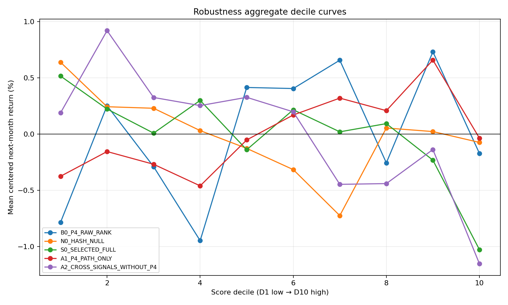
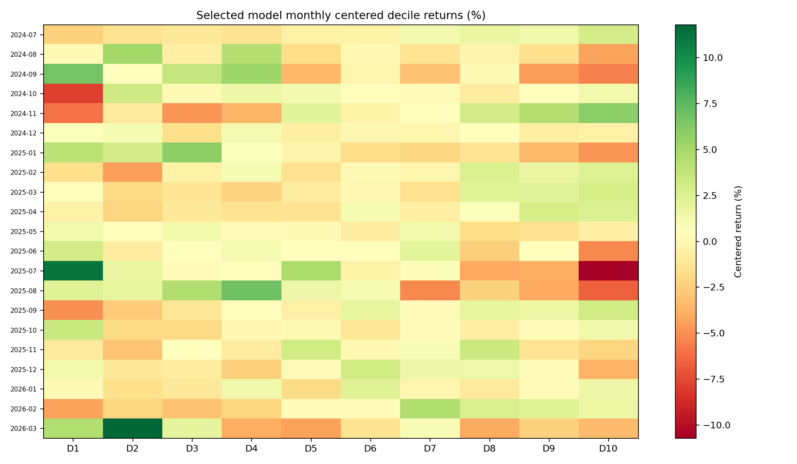

# P4 多因子次月收益单调排序诊断（20B_P4_MLRANK v1）

## 结论

本轮冻结选择的模型族为 `M1_RIDGE_RANK_REGRESSION`，最终状态为 `20B_P4_MLRANK_metric_materialization_blocked`。
在 21 个完全留出的 robustness 月份上，selected full 的十桶聚合 Spearman 为 `-0.7333`，相邻有序率为 `0.3333`，逐月 security Rank IC 均值为 `0.0440`，D10-D1 为 `-0.0154`。原始 P4 对应值分别为 `0.5030`、`0.4444`、`-0.0073`、`0.0061`。

本轮机器终态是 metric blocker：冻结的 M2 LambdaRank 产出 finite 但完全相同的 score，导致 validation security Rank IC 按 Spearman 定义不可计算；因此 `metric_materialization_gate=false`。不能用事后填零、改权重或改超参数绕过冻结合同。下述 M1 robustness 数值保留为诊断读出，但不构成 ordering-improved terminal claim。

这回答的是“排序能否更接近次月横截面收益的单调顺序”，不是“每个桶是否为正收益”。所有 gate 都使用 centered return 或排序指标；市场共同涨跌、现金/国债配置与 long-only participation regime 不属于本轮结论。

## Validation：候选模型冻结选择

| scored_model_id | aggregate_bucket_mean_spearman | adjacent_order_rate | mean_security_rank_ic | D10_minus_D1 | candidate_eligible | selection_rank |
|---|---|---|---|---|---|---|
| B0_P4_RAW_RANK | 0.7697 | 0.6667 | 0.0604 | 0.0247 | False | NA |
| M1_RIDGE_RANK_REGRESSION | 0.7939 | 0.6667 | 0.1135 | 0.0254 | True | 1.0000 |
| M2_LIGHTGBM_LAMBDARANK | -0.6242 | 0.5556 | NA | -0.0165 | False | 2.0000 |
| N0_HASH_NULL | -0.4788 | 0.6667 | -0.0271 | -0.0028 | False | NA |

选择严格只比较 M1/M2，排序键为 bucket Spearman、相邻有序率、平均 Rank IC，再以 M1 优先作为复杂度 tie-break。B0 与 N0 完整展示但不参加选择。
M2 的常数 score 使 Rank IC 显示为 `NA`；该 candidate 仍完整保留，并触发 metric materialization blocker。

## Robustness：完整模型与消融

| scored_model_id | aggregate_bucket_mean_spearman | adjacent_order_rate | mean_security_rank_ic | D10_minus_D1 | maximum_adjacent_inversion | evaluable_month_n |
|---|---|---|---|---|---|---|
| A1_P4_PATH_ONLY | 0.7818 | 0.5556 | 0.0134 | 0.0034 | 0.0069 | 21 |
| A2_CROSS_SIGNALS_WITHOUT_P4 | -0.7333 | 0.4444 | 0.0431 | -0.0134 | 0.0102 | 21 |
| B0_P4_RAW_RANK | 0.5030 | 0.4444 | -0.0073 | 0.0061 | 0.0091 | 21 |
| N0_HASH_NULL | -0.6242 | 0.1111 | -0.0126 | -0.0071 | 0.0041 | 21 |
| S0_SELECTED_FULL | -0.7333 | 0.3333 | 0.0440 | -0.0154 | 0.0080 | 21 |

前 10 个月 selected Spearman 为 `0.3455`，后 11 个月为 `-0.6242`。这两个子段只作稳定性读出，从未参与选择或调参。

## 四项消融读出

| metric_id | baseline_value | full_value | A1_value | A2_value | full_minus_baseline | A1_minus_baseline | A2_minus_baseline |
|---|---|---|---|---|---|---|---|
| aggregate_bucket_mean_spearman | 0.5030 | -0.7333 | 0.7818 | -0.7333 | -1.2364 | 0.2788 | -1.2364 |
| adjacent_order_rate | 0.4444 | 0.3333 | 0.5556 | 0.4444 | -0.1111 | 0.1111 | 0.0000 |
| mean_security_rank_ic | -0.0073 | 0.0440 | 0.0134 | 0.0431 | 0.0513 | 0.0207 | 0.0504 |
| D10_minus_D1 | 0.0061 | -0.0154 | 0.0034 | -0.0134 | -0.0216 | -0.0027 | -0.0196 |

A1 只保留 P4 path，A2 只保留 P0/P1/P6 cross-signals；这里报告机械差值，不设置或输出未冻结的 composite attribution 标签。

## Moving-block bootstrap

| challenger_scored_model_id | metric_id | p05 | p50 | p95 | CI_lower_gt_zero |
|---|---|---|---|---|---|
| S0_SELECTED_FULL | aggregate_bucket_mean_spearman | -1.4303 | -0.5697 | 0.6909 | False |
| S0_SELECTED_FULL | adjacent_order_rate | -0.3333 | -0.1111 | 0.1111 | False |
| S0_SELECTED_FULL | mean_security_rank_ic | -0.0406 | 0.0559 | 0.1459 | False |
| S0_SELECTED_FULL | D10_minus_D1 | -0.0599 | -0.0197 | 0.0142 | False |
| A1_P4_PATH_ONLY | aggregate_bucket_mean_spearman | -0.3758 | 0.0606 | 0.5333 | False |
| A1_P4_PATH_ONLY | adjacent_order_rate | -0.2222 | 0.0000 | 0.2222 | False |
| A1_P4_PATH_ONLY | mean_security_rank_ic | -0.0073 | 0.0186 | 0.0492 | False |
| A1_P4_PATH_ONLY | D10_minus_D1 | -0.0130 | -0.0013 | 0.0118 | False |
| A2_CROSS_SIGNALS_WITHOUT_P4 | aggregate_bucket_mean_spearman | -1.6606 | -0.8121 | 0.8000 | False |
| A2_CROSS_SIGNALS_WITHOUT_P4 | adjacent_order_rate | -0.3333 | -0.1111 | 0.2222 | False |
| A2_CROSS_SIGNALS_WITHOUT_P4 | mean_security_rank_ic | -0.0670 | 0.0567 | 0.1688 | False |
| A2_CROSS_SIGNALS_WITHOUT_P4 | D10_minus_D1 | -0.0610 | -0.0162 | 0.0244 | False |

区间是长度 3、非循环 moving blocks、5,000 次 PCG64 重采样的双侧 90% 区间；`p05/p95` 是区间下/上界。
Bootstrap confidence flag 为 `point_estimate_not_jointly_bootstrap_supported`。

## Coverage、strict sensitivity 与容量警示

Primary known-only 在 selected full 的 21 个 robustness 月份均可评价；all-resolved strict sensitivity 可评价 `9` 个月。Unknown 不改变 score 或 membership，只在桶收益处删除并按 known rows 等权。
D10 one-way turnover 与冻结 feature importance 已分别输出到 `historical/top_bucket_turnover_monthly.csv` 和 `models/model_feature_importance.csv`，仅作描述性容量/复杂度警示，不进入 gate。

## 审计边界

- 样本固定为 63 个月、25,049 个 P4 base rows；train/validation/robustness 分别为 30/12/21 个月。
- feature-worker 只读取 assignment 的信号身份与 `raw_signal` 列，outcome read count 恒为 0。
- paper proxy 未读取、未物化，P5 retrospective route 未进入特征。
- 两次 fresh-process replay 的 registered core comparison gate 为 `true`。
- 当前 workspace 用户指令直接授权本轮实现、历史 outcome 读取与模型训练，不需要独立审批文件；这不改变 outcome-contaminated historical diagnostic 的 claim ceiling。
- 本轮没有现金、国债、成本后 NAV、成交执行或 deployment 结论；不授权组合优化、部署或 20C 执行。
- `multi_factor_model_allowed=true`；`P4_single_factor_repair_claim_allowed=false`。learned score 不可表述为纯 residual-momentum alpha。
