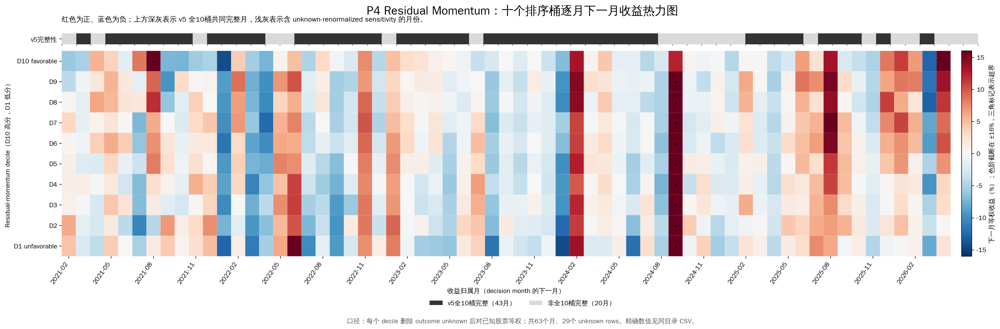
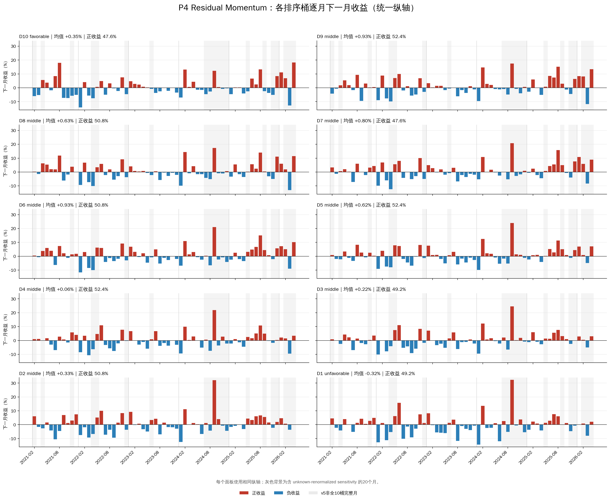

# 20B-P4-CAP：Unknown 延迟退出与持仓容量敏感性中文详细报告

> 本文是 `20B_P4_unknown_deferred_exit_bucket_capacity_diagnostic_v0` 的中文解释性 companion report。正式机器输出位于同名 run bundle 内。本文不修改 sealed `20B_v5`，也不改变新 run 的 manifest/hash。

## 1. 执行结论

本轮已经实际完成，而不是 requirement-only：

```text
decision_state = complete_descriptive_capacity_diagnostic
capacity_set = 5|10|20|30|40|50
signal_month_n = 63
held_unknown_case_n = 4
resolved_deferred_exit_n = 4
bridge_lineage_mismatch_n = 0
historical_support_claim_allowed = false
20C_requirement_generation_authorized = false
deployment_authorized = false
```

核心结果是：

1. 不再让未持有的 middle unknown 污染整个 P4 月份后，六档容量均恢复到 `63` 个可评价形成月；
2. 六档 full-sample Top-N 等权收益均为正，`N=30/40/50` 高于 `N=5/10/20`；
3. 但所有容量的 early fold 都为负，所有容量的 late fold 都为正，P4 仍存在明显时期翻转；
4. 实际进入 Top-N 的 unknown 只有 `4` 个股票-形成月，全部在第二自然月找到退出价；
5. deferred exits 对任一容量 full 月均收益的最大贡献仅 `0.0108` 个百分点，容量差异不是由这4个特殊案例主导；
6. `N=50` 的 full 均值最高，但容量集合是在看到 v5 outcome 后提出，不能把它升级为“最优容量”。

## 2. 与 sealed v5 的关系

本轮只复用 v5 已物化的 P4 signal：

```text
arm_id = P4_RESMOM_R2_MARKET_ONLY_ADAPTATION
semantic_track = project_sequential_market_residual_primary
score = raw_signal
formation = t-11 ... t-1 residual momentum
market model = sequential prior-36-month OLS
```

本轮没有：

- 重新估计 P4 market beta；
- 改变11个月 residual score；
- 调整 signal-eligible universe；
- 修改 v5 的43个月官方 readout；
- 把本轮结果写回 v5 decision 或 manifest。

本轮是 outcome 已知后的 follow-up sensitivity，因此固定属于：

```text
historical_sample_role = design_contaminated_followup
inference_role = descriptive_not_support
```

## 3. “桶容量”的精确定义

这里的 `5/10/20/30/40/50` 是每个极端桶持有的股票数量，不是把横截面分成5、10、20、30、40、50个 quantile。

每个 decision month 机械执行：

```text
按 raw_signal 降序、instrument_id 升序稳定排序
前 N 名 -> favorable_top_n
后 N 名 -> unfavorable_bottom_n
其他股票 -> not_selected_middle
Top-N / Bottom-N 均等权
```

Primary portfolio 是 long-only `favorable_top_n`。Bottom-N 仅用于排序 morphology comparator，不代表实际做空组合。

## 4. 新 Unknown 规则

### 4.1 Middle unknown

如果 unknown 不在 Top-N 或 Bottom-N：

```text
not_selected_middle
-> 没有持仓
-> 不进入收益计算
-> 不影响 Top-N 月份可评价性
```

这修复了 v5 中“middle bucket 一只 unknown 令所有10个 decile 同月删除”的非线性放大。

### 4.2 Bottom-N unknown

如果 unknown 落在 Bottom-N：

```text
从 bottom comparator 删除
对剩余 bottom 股票重新等权
记录 nominal N / effective N / deleted unknown N
```

这是用户指定的 comparator sensitivity，不是可交易 short portfolio 声明。

### 4.3 Top-N unknown

如果 unknown 已进入 Top-N，它是形成时真实持仓，不能事后删除并重分权重：

```text
t     ：形成并持有，原始权重 1/N
t+1   ：月末 outcome unknown，不强行删除
t+2   ：第二自然月首个可得 qfq close 卖出
return：exit_mark_t+2 / formation_mark_t - 1
```

因此含 deferred exit 的 formation cohort 混合了一个月和约两个月持有期，只能解释为：

```text
formation_cohort_deferred_exit_gross_return
```

不能解释成普通独立月收益、逐月 NAV 或成本后组合收益。

## 5. 数据桥与可验证性

原 v5 qfq/status 输入快照目前不在工作区，因此4个真实 held unknown 使用当前腾讯 qfq 日线补充退出桥。

固定标记：

```text
provider = tencent_ifzq_qfq
mixed_provider_bridge_sensitivity = true
```

每个接口原始 JSON、URL、访问时间和 payload SHA-256 均已保存在新 run 的 `source/` 目录。

四个案例的“首月最后交易日期”与 v5 `outcome_resolution_audit` 全部一致，`bridge_lineage_mismatch_n=0`。这只验证日期断点一致，不代表两个 provider 的历史调整因子完全等同。

## 6. Full sample 容量结果

Primary weighting 均为等权：

| Top-N容量 | 可评价月 | Top-N月均 | 月收益>0 | Bottom-N均值 | Top-Bottom | Top held unknown | Bottom删除unknown | Middle忽略unknown |
|---:|---:|---:|---:|---:|---:|---:|---:|---:|
| 5 | 63 | +0.2426% | 49.21% | +0.0982% | +0.1444% | 0 | 1 | 28 |
| 10 | 63 | +0.2890% | 47.62% | -0.2131% | +0.5021% | 0 | 1 | 28 |
| 20 | 63 | +0.2074% | 41.27% | -0.2426% | +0.4500% | 0 | 1 | 28 |
| 30 | 63 | +0.4382% | 44.44% | -0.2631% | +0.7013% | 0 | 1 | 28 |
| 40 | 63 | +0.4948% | 47.62% | -0.2990% | +0.7937% | 1 | 2 | 26 |
| 50 | 63 | +0.5240% | 44.44% | -0.3120% | +0.8361% | 4 | 2 | 23 |

### 6.1 如何理解容量形态

- `N=5 -> 10`：Top-N 均值上升 `+0.0464` 个百分点/月；
- `N=10 -> 20`：均值反而下降 `-0.0816` 个百分点/月；
- `N=20 -> 30`：均值上升 `+0.2308` 个百分点/月；
- `N=30 -> 40`：再上升 `+0.0566` 个百分点/月；
- `N=40 -> 50`：再上升 `+0.0293` 个百分点/月。

所以结果不是“容量越大收益严格单调越高”。更准确的形态是：

```text
5/10/20：约 +0.21% 至 +0.29%/形成月
30/40/50：约 +0.44% 至 +0.52%/形成月
```

主要增量出现在从20只扩展到30只的 shell。

## 7. Early / Late 稳定性

| Top-N容量 | Early N | Early Top-N | Early spread | Late N | Late Top-N | Late spread |
|---:|---:|---:|---:|---:|---:|---:|
| 5 | 32 | -0.9513% | +0.3172% | 31 | +1.4750% | -0.0338% |
| 10 | 32 | -0.8489% | +0.3855% | 31 | +1.4637% | +0.6226% |
| 20 | 32 | -0.7700% | +0.3470% | 31 | +1.2163% | +0.5564% |
| 30 | 32 | -0.4580% | +0.6204% | 31 | +1.3632% | +0.7848% |
| 40 | 32 | -0.3922% | +0.4934% | 31 | +1.4103% | +1.1038% |
| 50 | 32 | -0.3174% | +0.5687% | 31 | +1.3926% | +1.1120% |

最重要的观察不是 full-sample 最佳容量，而是：

```text
所有容量 early Top-N < 0
所有容量 late Top-N > 0
```

容量扩大能缓解 early 负收益的幅度，但不能消除方向翻转。因此，新 unknown 规则解决了月份可评价率，却没有解决 P4 的时间状态依赖。

## 8. HAC 诊断

Full-sample Top-N HAC p-value：

| N | HAC t | HAC p |
|---:|---:|---:|
| 5 | 0.235 | 0.814 |
| 10 | 0.322 | 0.747 |
| 20 | 0.274 | 0.784 |
| 30 | 0.546 | 0.585 |
| 40 | 0.663 | 0.507 |
| 50 | 0.782 | 0.434 |

Full-sample spread HAC p-value 从 N=5 的 `0.903` 降至 N=50 的 `0.284`，但没有一档达到普通5%水平。

HAC 仅为 design-only 描述。本轮既不是预注册容量检验，也没有多重比较授权，因此不能根据最小 p-value 选择容量。

## 9. 四个 Top-N deferred exits

| 股票 | 形成日 | 受影响容量 | 形成价 | 第二自然月退出日 | 退出价 | Deferred return | 持有日历日 |
|---|---|---|---:|---|---:|---:|---:|
| SH600372 | 2022-04-29 | 50 | 16.474 | 2022-06-13 | 21.404 | +29.9259% | 45 |
| SH601298 | 2023-05-31 | 50 | 6.227 | 2023-07-03 | 5.847 | -6.1025% | 33 |
| SZ002064 | 2024-09-30 | 50 | 8.100 | 2024-11-04 | 7.790 | -3.8272% | 35 |
| SZ002049 | 2025-11-28 | 40/50 | 75.754 | 2026-01-15 | 86.384 | +14.0323% | 48 |

数量关系：

```text
N <= 30：没有 held unknown
N = 40 ：1 个 held unknown
N = 50 ：4 个 held unknown
```

这些 deferred positions 对 full 月均的贡献：

```text
N=40：约 +0.0056 个百分点/月
N=50：约 +0.0108 个百分点/月
```

所以 `N=40/50` 的较高均值并不是延迟退出个案机械抬高造成的。

## 10. 相对 N=10 的共同月份差异

所有配对都使用相同63个 decision months：

| 容量N | Top-N减N10 | Spread减N10 |
|---:|---:|---:|
| 5 | -0.0464pp/月 | -0.3577pp/月 |
| 10 | 0 | 0 |
| 20 | -0.0816pp/月 | -0.0521pp/月 |
| 30 | +0.1491pp/月 | +0.1991pp/月 |
| 40 | +0.2057pp/月 | +0.2916pp/月 |
| 50 | +0.2350pp/月 | +0.3339pp/月 |

N=30–50 相对 N=10 的 full-sample paired delta 为正，但这仍是 outcome-known search，不能作为选择30、40或50只的正式证据。

## 11. 与 v5 官方 P4 readout 的差异

v5 官方 P4 使用：

```text
10个decile
要求所有10个decile同月完整
43个可评价月
```

其 official full readout 为：

```text
favorable = +0.5798%
spread = +1.6189%
```

本轮最接近原 decile 容量的是 N=40，但使用全部63个月：

```text
Top-40 = +0.4948%
Top40-Bottom40 = +0.7937%
```

两者不能直接当作纯粹 unknown-policy delta，因为同时存在：

1. 原 decile 每月股票数随 signal N 变化，N=40是固定容量；
2. v5 只保留所有10个decile都完整的43个月；
3. 本轮只要求实际持有Top-N可退出，Bottom-N允许删除unknown；
4. held unknown 使用变长持有期和补充provider bridge。

但方向上可以确认：恢复被 middle unknown 删除的月份后，spread 明显低于 v5 的43个月条件样本，early Top-N 也重新变为负值。

## 12. 逐月目标换手率

为了补充容量的交易强度解释，本节使用相邻 decision month 的 ex-ante 等权目标持仓计算单边目标换手率：

```text
target_turnover_t = 0.5 * sum_i(abs(w_i,t - w_i,t-1))
```

计算使用前后两个月份目标持仓的 union instrument set。对固定容量等权 Top-N，它等于当月被替换的仓位比例。v5 Top-decile 的月度股票数从 `29` 变化到 `44`，因此还包含存量成员因桶内股票数变化而产生的等权重归一。

本节固定解释边界：

- 这是不考虑持有期价格漂移的 target turnover，不是真实成交换手率；
- 本 run 没有原生 stateful daily NAV，因此不对停牌、涨跌停成交、冲击成本或价格漂移做伪精确修正；
- 4 个 deferred exits 属于实际持仓状态特例，当前 cohort-return bundle 不足以完整复原它们对后续月份 actual turnover 的影响；
- 使用全部 `63` 个 ex-ante signal months，而不是只使用事后收益可评价的 `43` 个月份；
- 2021-01-29 是首个目标组合，因没有前序组合而记为不可计算。若另行假设从现金首次建仓，则该次初始建仓换手可记为 `100%`，但不纳入下述均值。

### 12.1 62 个相邻月转换的汇总

| 组合 | 月均目标换手率 | 月度转换数 |
|---|---:|---:|
| Top-5 | 50.97% | 62 |
| Top-10 | 47.42% | 62 |
| Top-20 | 41.05% | 62 |
| Top-30 | 38.39% | 62 |
| Top-40 | 37.18% | 62 |
| Top-50 | 34.39% | 62 |
| v5 动态 Top-decile | 37.86% | 62 |

v5 动态 Top-decile 的中位换手率为 `38.01%`，最低为 2022-10-31 的 `23.68%`，最高为 2025-01-27 的 `56.82%`。`37.86%` 是单边换手定义；若仅为表达买入额加卖出额的总交易名义金额，对应均值约为组合净值的 `75.72%`/month。

容量扩大后换手率总体下降，但并非每个月都单调。例如 2024-08-30 的 Top-50 换手率为 `52%`，高于 Top-40 的 `47.5%`；扩大容量降低的是长期平均替换强度，不是每期必然换手。

### 12.2 逐月明细

表中“收益归属月”是该 decision-date 目标组合对应的 `label_month`。

| 调仓日 | 收益归属月 | v5 Top-decile N | v5 Top-decile | Top-5 | Top-10 | Top-20 | Top-30 | Top-40 | Top-50 |
|---|---|---:|---:|---:|---:|---:|---:|---:|---:|
| 2021-01-29 | 2021-02 | 29 | — | — | — | — | — | — | — |
| 2021-02-26 | 2021-03 | 29 | 37.93% | 80% | 70% | 45% | 36.67% | 32.50% | 32% |
| 2021-03-31 | 2021-04 | 30 | 33.33% | 20% | 50% | 45% | 30% | 32.50% | 36% |
| 2021-04-30 | 2021-05 | 31 | 54.84% | 60% | 50% | 50% | 53.33% | 47.50% | 40% |
| 2021-05-31 | 2021-06 | 30 | 38.71% | 20% | 30% | 45% | 40% | 37.50% | 30% |
| 2021-06-30 | 2021-07 | 31 | 32.26% | 80% | 60% | 30% | 33.33% | 27.50% | 30% |
| 2021-07-30 | 2021-08 | 31 | 45.16% | 100% | 50% | 40% | 43.33% | 45% | 42% |
| 2021-08-31 | 2021-09 | 32 | 37.50% | 60% | 50% | 45% | 36.67% | 40% | 40% |
| 2021-09-30 | 2021-10 | 33 | 27.27% | 20% | 30% | 15% | 23.33% | 22.50% | 24% |
| 2021-10-29 | 2021-11 | 32 | 45.45% | 20% | 30% | 45% | 46.67% | 37.50% | 28% |
| 2021-11-30 | 2021-12 | 33 | 42.42% | 40% | 40% | 45% | 36.67% | 45% | 42% |
| 2021-12-31 | 2022-01 | 33 | 48.48% | 60% | 50% | 50% | 50% | 42.50% | 38% |
| 2022-01-28 | 2022-02 | 34 | 50.00% | 80% | 60% | 55% | 53.33% | 50% | 48% |
| 2022-02-28 | 2022-03 | 35 | 40.00% | 20% | 50% | 50% | 36.67% | 35% | 34% |
| 2022-03-31 | 2022-04 | 35 | 42.86% | 20% | 30% | 45% | 46.67% | 42.50% | 34% |
| 2022-04-29 | 2022-05 | 35 | 54.29% | 60% | 30% | 60% | 53.33% | 50% | 36% |
| 2022-05-31 | 2022-06 | 35 | 25.71% | 20% | 40% | 35% | 36.67% | 30% | 30% |
| 2022-06-30 | 2022-07 | 36 | 33.33% | 80% | 60% | 25% | 23.33% | 30% | 20% |
| 2022-07-29 | 2022-08 | 36 | 38.89% | 60% | 70% | 55% | 40% | 37.50% | 32% |
| 2022-08-31 | 2022-09 | 37 | 27.03% | 40% | 20% | 30% | 30% | 27.50% | 22% |
| 2022-09-30 | 2022-10 | 37 | 29.73% | 20% | 30% | 35% | 30% | 32.50% | 18% |
| 2022-10-31 | 2022-11 | 38 | 23.68% | 60% | 40% | 35% | 30% | 27.50% | 30% |
| 2022-11-30 | 2022-12 | 38 | 39.47% | 60% | 50% | 45% | 43.33% | 40% | 34% |
| 2022-12-30 | 2023-01 | 39 | 35.90% | 60% | 30% | 35% | 33.33% | 35% | 30% |
| 2023-01-31 | 2023-02 | 40 | 40.00% | 40% | 40% | 35% | 36.67% | 40% | 42% |
| 2023-02-28 | 2023-03 | 39 | 32.50% | 40% | 50% | 30% | 26.67% | 32.50% | 30% |
| 2023-03-31 | 2023-04 | 40 | 40.00% | 20% | 40% | 40% | 40% | 40% | 34% |
| 2023-04-28 | 2023-05 | 41 | 46.34% | 80% | 70% | 35% | 40% | 45% | 42% |
| 2023-05-31 | 2023-06 | 41 | 43.90% | 60% | 60% | 40% | 40% | 42.50% | 40% |
| 2023-06-30 | 2023-07 | 41 | 41.46% | 40% | 40% | 40% | 43.33% | 40% | 42% |
| 2023-07-31 | 2023-08 | 41 | 31.71% | 80% | 50% | 35% | 43.33% | 32.50% | 28% |
| 2023-08-31 | 2023-09 | 41 | 31.71% | 40% | 50% | 50% | 43.33% | 32.50% | 26% |
| 2023-09-28 | 2023-10 | 41 | 29.27% | 60% | 70% | 50% | 33.33% | 30% | 26% |
| 2023-10-31 | 2023-11 | 42 | 35.71% | 20% | 60% | 40% | 30% | 32.50% | 32% |
| 2023-11-30 | 2023-12 | 42 | 38.10% | 20% | 30% | 40% | 33.33% | 35% | 34% |
| 2023-12-29 | 2024-01 | 42 | 28.57% | 60% | 70% | 50% | 36.67% | 30% | 36% |
| 2024-01-31 | 2024-02 | 42 | 28.57% | 40% | 60% | 30% | 30% | 32.50% | 28% |
| 2024-02-29 | 2024-03 | 42 | 38.10% | 60% | 50% | 40% | 36.67% | 35% | 34% |
| 2024-03-29 | 2024-04 | 43 | 27.91% | 40% | 20% | 25% | 26.67% | 25% | 30% |
| 2024-04-30 | 2024-05 | 43 | 37.21% | 60% | 70% | 45% | 36.67% | 35% | 40% |
| 2024-05-31 | 2024-06 | 43 | 34.88% | 60% | 40% | 40% | 36.67% | 32.50% | 34% |
| 2024-06-28 | 2024-07 | 43 | 30.23% | 40% | 50% | 45% | 40% | 35% | 30% |
| 2024-07-31 | 2024-08 | 43 | 27.91% | 60% | 50% | 55% | 36.67% | 30% | 26% |
| 2024-08-30 | 2024-09 | 43 | 48.84% | 100% | 40% | 40% | 50% | 47.50% | 52% |
| 2024-09-30 | 2024-10 | 44 | 29.55% | 40% | 30% | 30% | 20% | 27.50% | 24% |
| 2024-10-31 | 2024-11 | 44 | 38.64% | 40% | 50% | 50% | 46.67% | 37.50% | 38% |
| 2024-11-29 | 2024-12 | 44 | 45.45% | 60% | 50% | 45% | 46.67% | 42.50% | 44% |
| 2024-12-31 | 2025-01 | 44 | 34.09% | 40% | 30% | 30% | 36.67% | 37.50% | 28% |
| 2025-01-27 | 2025-02 | 43 | 56.82% | 40% | 50% | 45% | 50% | 55% | 54% |
| 2025-02-28 | 2025-03 | 44 | 36.36% | 60% | 40% | 40% | 40% | 35% | 34% |
| 2025-03-31 | 2025-04 | 44 | 45.45% | 60% | 60% | 40% | 40% | 42.50% | 46% |
| 2025-04-30 | 2025-05 | 44 | 25.00% | 20% | 50% | 40% | 33.33% | 25% | 26% |
| 2025-05-30 | 2025-06 | 44 | 34.09% | 20% | 40% | 35% | 40% | 37.50% | 32% |
| 2025-06-30 | 2025-07 | 44 | 40.91% | 60% | 50% | 50% | 36.67% | 40% | 40% |
| 2025-07-31 | 2025-08 | 44 | 31.82% | 80% | 50% | 30% | 30% | 30% | 30% |
| 2025-08-29 | 2025-09 | 44 | 45.45% | 80% | 70% | 60% | 53.33% | 50% | 38% |
| 2025-09-30 | 2025-10 | 44 | 54.55% | 80% | 60% | 60% | 60% | 57.50% | 46% |
| 2025-10-31 | 2025-11 | 44 | 38.64% | 100% | 40% | 35% | 36.67% | 37.50% | 38% |
| 2025-11-28 | 2025-12 | 44 | 43.18% | 40% | 50% | 25% | 33.33% | 42.50% | 36% |
| 2025-12-31 | 2026-01 | 44 | 36.36% | 40% | 70% | 60% | 40% | 37.50% | 34% |
| 2026-01-30 | 2026-02 | 44 | 38.64% | 40% | 40% | 35% | 43.33% | 42.50% | 32% |
| 2026-02-27 | 2026-03 | 44 | 36.36% | 60% | 60% | 50% | 33.33% | 40% | 42% |
| 2026-03-31 | 2026-04 | 44 | 38.64% | 40% | 20% | 20% | 33.33% | 35% | 34% |

## 13. 绝对排序收益与 regime 验证

本节验证一个与 long-only 直接相关的假设：既然 residual-momentum Top-N 的绝对收益会受共同市场/风格状态影响，那么十个排序桶的绝对收益曲面是否能识别 regime，以及这个状态能否在下一个收益期开始前被预测。

必须区分两个问题：

```text
当月十桶实现收益 -> 能否 ex-post 描述当月 regime？
decision-time score/滞后桶收益 -> 能否 ex-ante 预测下一月 regime？
```

只有第二个问题得到肯定证据，才能用它支持现金/短债 participation gate。用已实现的当月收益解释同一月只是 outcome label，不是可部署择时。

### 13.1 数据口径与共同收益代理

本节使用 sealed v5 `instrument_month_signal_bucket_assignment.parquet` 中：

```text
arm_id = P4_RESMOM_R2_MARKET_ONLY_ADAPTATION
semantic_track = project_sequential_market_residual_primary
bucket_count = 10
signal_eligible = true
```

共有 `25,049` 个 instrument-month rows、`63` 个 signal months。其中 `29` 个 rows 的 outcome unknown，已知收益覆盖率为 `99.884%`，任一月任一桶最低已知覆盖率为 `95.45%`。

为使用全部63个月份，本节对每个 decile 删除 outcome unknown 后对剩余股票等权。这只是 regime 归因 sensitivity，不修改 v5 官方全10桶共同完整规则，也不用于替换本报告的 capacity return。同时在 v5 官方 `43` 个全10桶完整月份上重复主要计算，作为 unknown-policy 稳健性对照。

定义当月横截面共同收益代理：

```text
cross_section_common_return_proxy_t
    = mean(project_resolved_next_month_return_i,t over known P4 signal-eligible rows)

expost_risk_on_t  = common_return_proxy_t >= 0
expost_risk_off_t = common_return_proxy_t < 0
```

该 proxy 是同一 P4 股票截面的 outcome common component，不是可投资市场指数、不含现金收益，也不是事前可知的 regime feature。它只用于检查十个排序桶是否存在同向的收益位移。

### 13.2 绝对桶收益能清楚识别当月共同状态

| Ex-post 状态 | 月份数 | 共同收益代理 | Top-decile | Bottom-decile | Top-Bottom | 平均负收益桶数 | 平均正收益桶数 |
|---|---:|---:|---:|---:|---:|---:|---:|
| risk-off | 33 | -3.3285% | -3.0066% | -4.3722% | +1.3656% | 8.21 / 10 | 1.79 / 10 |
| risk-on | 30 | +4.6169% | +4.0365% | +4.1437% | -0.1072% | 1.40 / 10 | 8.60 / 10 |

两种状态下的十桶绝对收益曲面：

| Ex-post 状态 | D1 unfavorable | D2 | D3 | D4 | D5 | D6 | D7 | D8 | D9 | D10 favorable |
|---|---:|---:|---:|---:|---:|---:|---:|---:|---:|---:|
| risk-off | -4.3722% | -3.0425% | -3.3188% | -3.6428% | -2.9924% | -3.1765% | -3.2738% | -3.3454% | -3.1109% | -3.0066% |
| risk-on | +4.1437% | +4.0472% | +4.1050% | +4.1348% | +4.5965% | +5.4523% | +5.2899% | +5.0086% | +5.3756% | +4.0365% |

这个曲面证明：

- risk-off 中 Top 桶确实比 Bottom 桶少跌，但 `+1.3656%` spread 不能阻止 long-only Top 桶亏损 `-3.0066%`；
- risk-on 中几乎所有桶共同上涨，Top 桶获得 `+4.0365%`，但排序 spread 反而接近零；
- 63个月份中，`15` 个月份十桶全部为负，`13` 个月份十桶全部为正。

对十桶收益矩阵作未标准化的 covariance PCA：

```text
PC1 explained variance ratio = 81.40%
all ten PC1 loadings have the same sign
corr(PC1, common return proxy) = 0.9999
```

Top-decile 与共同收益代理的 Pearson 相关为 `0.749`（`p < 2e-12`），单变量线性解释度为 `R²=56.1%`；spread 与共同代理的相关只有 `-0.218`（`p=0.087`）。因此 long-only 收益受共同状态强烈影响，而相对排序 spread 是不同的维度。

在 v5 官方43个完整月份上，PC1 解释度为 `81.14%`，Top-decile 与共同代理相关为 `0.759`。所以这一结论不是删除29个 unknown rows 才产生的假象。

#### 13.2.1 十桶 × 63个收益月热力图

下图的横轴是 `label_month`，即 decision month 形成组合后的下一收益月；纵轴从高分 `D10 favorable` 排到低分 `D1 unfavorable`。红色为正收益，蓝色为负收益。上方深灰色状态条表示 v5 全10桶共同完整的43个月，浅灰表示含 unknown-renormalized sensitivity 的20个月。色阶固定截断在 `±16%`，黑色三角表示绝对收益超出色阶，实际值保留在绘图 CSV 中。



热力图中大量跨越 D1–D10 的红色或蓝色竖向带，是十桶收益被共同 regime 整体上移/下移的直观证据。如果排序形态稳定，应经常看到从 D1 到 D10 的持续渐变色阶；实际图形更常见同月所有桶同色，且局部桶高低并不按 D1→D10 单调变化。

#### 13.2.2 每个桶的逐月小多图

下图把10个桶分开，但全部使用同一纵轴，避免各面板自动缩放造成稳定性错觉。红色柱是正收益，蓝色柱是负收益，灰色背景是 v5 非全10桶完整月。



小多图同时显示：

- `D10 favorable` 的63月均值只有约 `+0.35%`，正收益月占 `47.6%`；
- `D6` 与 `D9` 均值都约为 `+0.93%`，高于 D10，再次显示收益曲线不是稳定的单调排序；
- 大多数桶在同一月同时转正或转负，因此 long-only 组合的主要风险不是个别桶的随机波动，而是跨桶共同收益状态。

图中630个 `decision month × decile` 绘图单元的精确数据、nominal/known/unknown N、已知覆盖率与 v5 全10桶完整标记保存在：

- [`p4_decile_next_month_returns.csv`](20B_P4_unknown_deferred_exit_bucket_capacity_diagnostic_v0_detailed_report_cn_assets/p4_decile_next_month_returns.csv)

### 13.3 容量越大，Top-N 越接近共同 regime exposure

| 容量 | corr(Top-N, common proxy) | R² | risk-off Top-N 均值 | risk-on Top-N 均值 | risk-off Top-N > 0 | risk-on Top-N > 0 |
|---:|---:|---:|---:|---:|---:|---:|
| 5 | 0.522 | 27.3% | -1.3885% | +2.0368% | 42.42% | 56.67% |
| 10 | 0.637 | 40.5% | -1.9558% | +2.7584% | 33.33% | 63.33% |
| 20 | 0.698 | 48.8% | -2.7891% | +3.5036% | 21.21% | 63.33% |
| 30 | 0.709 | 50.2% | -2.8940% | +4.1035% | 21.21% | 70.00% |
| 40 | 0.767 | 58.8% | -2.9075% | +4.2373% | 27.27% | 70.00% |
| 50 | 0.811 | 65.8% | -2.9776% | +4.3759% | 21.21% | 70.00% |

表中 Top-N 继承本 run 的 `formation_cohort_deferred_exit_gross_return` 口径，其中4个 held unknown 使用变长持有期；因此这仍是共同状态的描述性暴露诊断，不是同持有期的 stateful NAV beta 估计。第9节已显示4个 deferred exits 对 full 月均的贡献很小，不会机械主导此处容量梯度。

容量扩大降低了个股集中度，但也使组合更接近一个经过 residual-score 筛选的正 beta 股票篮子。这与第7节“扩大容量缓解 early 负收益幅度，但不消除 early/late 翻转”一致。

### 13.4 Raw residual-score 绝对水平未显示稳定的 ex-ante 预测力

P4 decision month `t` 的原始分数为：

```text
R2_score(i,t) = mean(e_R2 over t-11...t-1) / sample_std(e_R2, ddof=1)
```

它是过去11个 residual months 的风险调整强度，不是已校准的下一月绝对收益预测。使用决策时可见的 score 横截面特征：

| Ex-ante score feature | corr(next common proxy) | p | corr(next Top-decile) | p |
|---|---:|---:|---:|---:|
| raw score mean | -0.080 | 0.536 | -0.203 | 0.111 |
| raw score median | -0.126 | 0.326 | -0.211 | 0.097 |
| positive-score breadth | -0.138 | 0.280 | -0.220 | 0.083 |
| raw score cross-sectional std | -0.007 | 0.954 | +0.050 | 0.699 |

表中 `p` 是未做多重比较修正的探索性 Pearson p-value，不是正式 gate。加入线性时间趋势并使用 HAC lag 3 后，raw mean/median/breadth/std 对 Top-decile 的系数 p-value 分别为 `0.289/0.199/0.114/0.885`。

样本内甚至出现反向现象：

| 自然阈值 | 月份数 | 下一月 Top-decile 均值 | Top-decile > 0 |
|---|---:|---:|---:|
| raw mean > 0 | 13 | -4.0414% | 30.77% |
| raw mean <= 0 | 50 | +1.4883% | 52.00% |
| raw median > 0（等价于 positive breadth > 50%） | 21 | -2.0188% | 42.86% |
| raw median <= 0 | 42 | +1.5302% | 50.00% |

这可以作为“高 residual breadth 可能表示拥挤/过度延续”的探索线索，但不能直接反转成 contrarian gate：关系在年度子样本中方向不一致，Early 估计后直接用于 Late 的单变量预测，方向准确率只有 `45.2%–51.6%`，MSE 相对于训练均值基准的比率约为 `0.96–1.03`。

### 13.5 滞后绝对桶收益也未显示可用的下一月 regime persistence

当月桶收益只能在下一个调仓点被使用。因此进一步用上一月或截至上一月的三月均值预测当月：

| 滞后 feature | 可评价转换 | corr(next common proxy) | p | corr(next Top-decile) | p |
|---|---:|---:|---:|---:|---:|
| previous common proxy | 62 | -0.147 | 0.254 | -0.197 | 0.124 |
| previous Top-decile return | 62 | -0.067 | 0.604 | -0.050 | 0.698 |
| previous positive-bucket N | 62 | -0.148 | 0.250 | -0.213 | 0.096 |
| previous 3-month common mean | 60 | -0.170 | 0.195 | -0.115 | 0.383 |

共同收益代理正负号的相邻月持续率只有 `51.61%`。上月 common proxy 为正的29个转换中，下一月 Top-decile 均值为 `-0.2435%`；上月为负的33个转换中，下一月 Top-decile 反而为 `+1.0581%`。这些点估计没有支持简单的“上月十桶共同上涨，下月继续持股”规则。

### 13.6 验证结论与可用的下一步定位

| 验证问题 | 结果 | 研究判断 |
|---|---|---|
| 十桶绝对收益能否描述当月 regime | 强支持 | 可作为 ex-post outcome label |
| Top-N 绝对收益是否受共同状态主导 | 支持 | long-only 需要独立 participation/risk layer |
| Raw score 绝对水平能否提前预测下一月 | 未支持 | 不能直接把 score 高低写成现金 gate |
| 上一月绝对桶收益能否预测下一月 | 未支持 | 简单 regime persistence 规则不成立 |

因此，本节验证的最准确表述是：

```text
十桶绝对收益的共同成分 = 很好的 regime outcome/label
raw residual-score 绝对水平或滞后桶收益 != 已验证的 ex-ante regime predictor
```

如果开启新的、事前冻结的 cash-inclusive 研究，更对齐效用的 participation meta-label 应定义为：

```text
participate_t = 1[
    TopN stateful next-open return_t
    - cash_or_short_treasury_return_t
    - executable_cost_t
    > 0
]
```

然后只使用 decision time 可见的市场趋势、波动率、回撤、市场宽度、流动性和 score-distribution features 预测它，在时间顺序 forward folds 中检验现金参与是否提高成本后效用。本轮的63个 outcome-known months 只能用来定义假设与设计新 contract，不能在同一样本内继续搜索阈值并宣告可部署策略。

## 14. 研究判断

### Finding 1：Unknown 主要是 evaluability 问题，不是持仓大面积失控

最多50只的 Top-N 中，63个月只有4个 held unknown。原 v5 丢失20个月，主要原因是 middle/bottom unknown 被全10桶共同完整规则放大。

### Finding 2：30–50只在 full sample 更强，但不是稳定最优

N=30/40/50 的 full 均值高于 N=5/10/20，但不存在严格单调关系，且这些容量在 early 仍全部为负。

### Finding 3：P4 的真正风险是 regime instability

无论容量如何，early/late 都发生同方向翻转。扩大容量降低集中度，却没有建立跨时期正收益。

### Finding 4：更合理的下一步不是继续搜索 N

如果继续研究，应在新的 forward/preoutcome contract 中预先选择少量容量，例如固定 `N=30/40/50` 或指定单一容量，并建立原生 stateful daily NAV、停牌持仓和退出规则；不应在当前63个月上继续搜索35、45、60等容量。

### Finding 5：绝对桶收益提供 regime label，但当前还没有 regime predictor

十桶收益第一主成分解释 `81.40%` 的方差，确认 P4 long-only 收益存在强共同状态；但 raw score 绝对水平、score breadth 和滞后桶收益都没有显示稳定的下一月预测力。因此现金/短债应在新研究中作为独立 participation action，不能直接混入当前股票横截面排序，也不能用本轮 outcome-known 阈值追认历史收益。

## 15. Evidence 与文件

正式 run bundle：

- `20B_P4_unknown_deferred_exit_bucket_capacity_diagnostic_v0/20B_P4_unknown_deferred_exit_bucket_capacity_diagnostic_report.md`
- `.../historical/p4_capacity_assignment.parquet`
- `.../historical/p4_capacity_monthly_returns.csv.gz`
- `.../historical/p4_capacity_summary.csv`
- `.../historical/p4_capacity_paired_delta_vs_10.csv`
- `.../historical/p4_capacity_shell_attribution.csv`
- `.../historical/p4_deferred_exit_audit.csv`
- `.../source/tencent_qfq_bridge_*.json`
- `.../manifest_20b_p4_capacity.json`
- `.../output_hashes_20b_p4_capacity.json`

中文 companion report 可视化 assets（不属于 sealed run bundle，不改变正式 manifest/hash）：

- `20B_P4_unknown_deferred_exit_bucket_capacity_diagnostic_v0_detailed_report_cn_assets/p4_decile_next_month_return_heatmap.png`
- `20B_P4_unknown_deferred_exit_bucket_capacity_diagnostic_v0_detailed_report_cn_assets/p4_decile_next_month_return_small_multiples.png`
- `20B_P4_unknown_deferred_exit_bucket_capacity_diagnostic_v0_detailed_report_cn_assets/p4_decile_next_month_returns.csv`

Requirement 与实现：

- `requirement_20b_p4_unknown_deferred_exit_bucket_capacity_diagnostic.md`
- `configs/config_20b_p4_unknown_deferred_exit_bucket_capacity_diagnostic.yaml`
- `src/run_20b_p4_unknown_deferred_exit_bucket_capacity_diagnostic.py`
- `tests/test_20b_p4_unknown_deferred_exit_bucket_capacity_diagnostic.py`

固定授权边界：

```text
historical_support_claim_allowed = false
20C_requirement_generation_authorized = false
20C_execution_authorized = false
policy_training_authorized = false
portfolio_optimization_authorized = false
deployment_authorized = false
```
